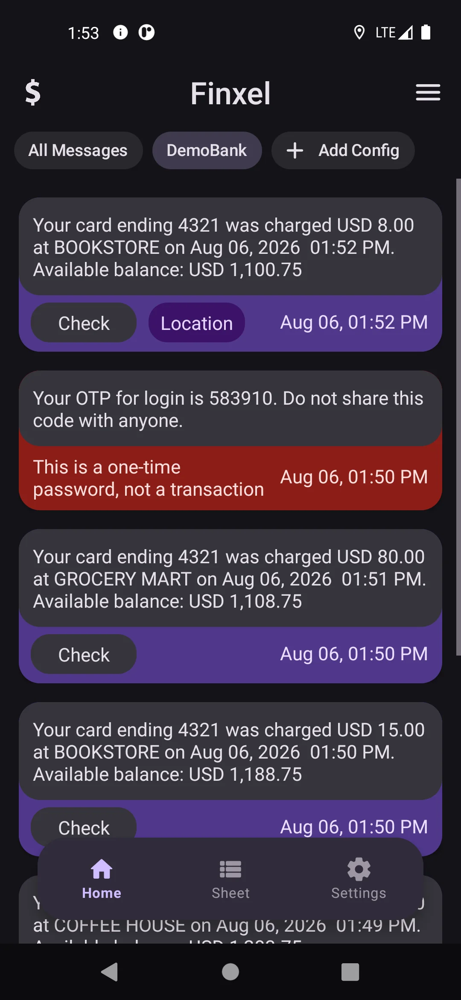
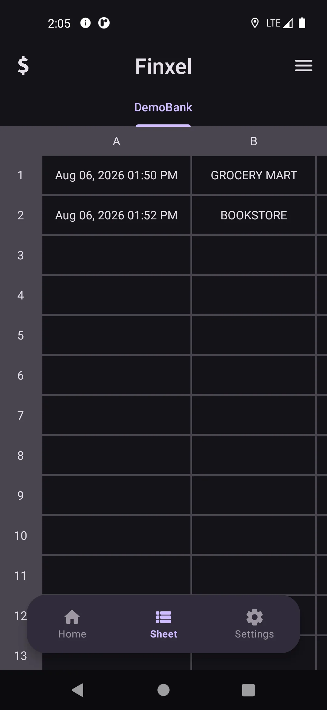
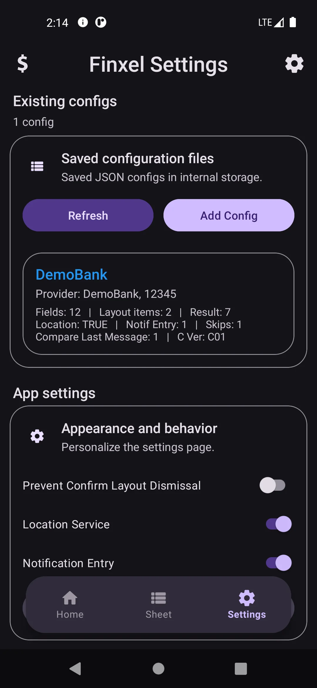

# Finxel Android App

Finxel is an open-source Android app that reads financial SMS messages (bank transactions, wallet top-ups, transfer confirmations, etc.) and turns them into structured, spreadsheet-style records automatically, using rules that **you** define in a simple JSON configuration file.

No manual copy-pasting of transaction details, and no server receives your SMS content or financial records. Transaction processing happens locally on your device.

| | | |
|:-:|:-:|:-:|
|  |  |  |

## What Finxel does

- **Watches incoming SMS** from the senders you configure (banks, payment providers, etc.).
- **Extracts the data you care about** amount, balance, date, reference number, and anything else you can describe with a regular expression using a configuration you write once.
- **Builds a live sheet** of extracted rows that you can review, check off, and copy straight into Excel, Google Sheets, or any spreadsheet app.
- **Optionally tags each message with a location** (Location Service), so you know *where* a transaction happened.
- **Optionally asks you for extra details right from the notification** (Notification Entry) e.g. "what was this purchase for?" without having to open the app.
- **Keeps a history** of your sheets so you can restore, re-download, or share a previous export at any time.

Finxel doesn't come with any built-in bank support out of the box. Instead, it's driven entirely by configuration files (small JSON documents) that describe how to recognize and parse messages from a specific provider. You can write your own, import one someone else made, or paste one from your clipboard.

> **Finxel only turns your messages into structured data it is not a place to keep your financial records.** Once a message has been processed into a row on the sheet, copy it out into your real finance spreadsheet (Google Sheets, Excel, or whatever you already use) and don't rely on Finxel itself to hold onto that data long-term. See [Getting Started](docs/getting-started.md#7-view-and-export-your-sheet) for how to copy your sheet out.

## Getting the app

Finxel is distributed as an installable APK through the **Releases** section of this repository. It is not (yet) published on the Google Play Store.

👉 See **[docs/getting-started.md](docs/getting-started.md)** for step-by-step download and installation instructions.

## Documentation

| Guide | What it covers |
|---|---|
| [Getting Started](docs/getting-started.md) | Downloading, installing, and setting up Finxel for the first time |
| [Permissions](docs/permissions.md) | Every permission Finxel asks for, why it's needed, and how to grant it |
| [Writing a Configuration](docs/write-configuration.md) | The full config file format: required and optional fields, field types, and examples |
| [Location Service](docs/location-service.md) | How automatic location tagging works and how to turn it on |
| [Notification Entry](docs/notification-entry.md) | How to collect extra info via reply-notifications when a message arrives |
| [Errors](docs/errors.md) | What the in-app error codes mean and how to fix them |
| [FAQ](docs/faq.md) | Common questions from users |
| [Building from Source](docs/building-from-source.md) | How to clone, build, and run Finxel yourself, including handling the Firebase dependency |

## Community

- 📢 **[Telegram Channel](https://t.me/FinxelApp)** — release announcements, changelogs, and news. One-way, low-traffic.
- 💬 **[Telegram Group](https://t.me/FinxelCommunity)** — chat with other users, ask questions, share configs/templates, and discuss issues.
- 🐛 For formal bug reports and feature requests, use [GitHub Issues](https://github.com/ahmadrezagh671/Finxel/issues) instead of the group, it's easier to track there.

## Requirements

- Android 9.0 (API level 28) or newer.
- A device that receives regular SMS messages.

## Privacy

Finxel processes SMS messages entirely on your device. Configuration files, extracted records, and history sheets are all stored locally, there is no Finxel server, and none of that data (message content, configs, sheets) ever leaves your phone.

Finxel does use Firebase Analytics to collect anonymous app-usage data. See the [FAQ](docs/faq.md#does-finxel-collect-or-send-any-of-my-data) for details.

## License

Finxel's own source code is released under the [MIT License](LICENSE).

Finxel also uses [Sora Editor](https://github.com/Rosemoe/sora-editor) (unmodified, as a library dependency) to power the in-app config JSON editor. Sora Editor is licensed separately under **LGPL-2.1**, not MIT. The editor's JSON syntax highlighting and dark color theme are adapted from Microsoft's open-source [vscode](https://github.com/microsoft/vscode) repository, licensed under **MIT**. See [THIRD-PARTY-NOTICES.md](THIRD-PARTY-NOTICES.md) for the full attribution and license details.

## Credits

Driven by logic. Built by **Ahmadrezagh671**.
