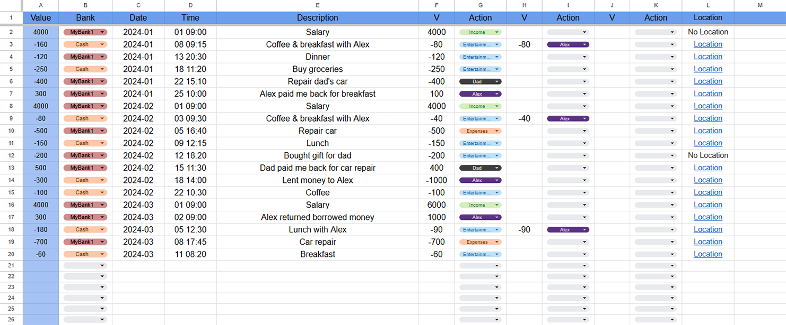
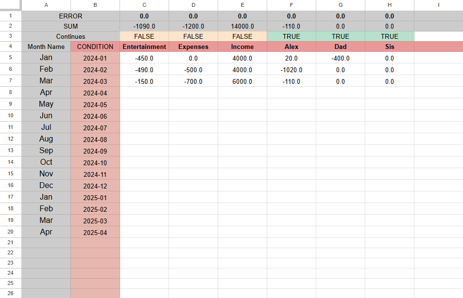
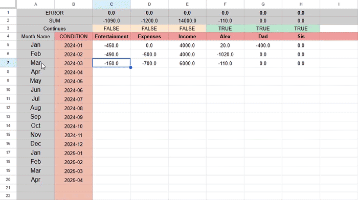

# Ahmad Sheet Template

A Google Sheets template built to receive Finxel's output directly, with monthly summaries per category/action, a running "carry-over vs. reset" balance system, and a built-in check that flags rows with a broken `Date` value.

**Template (Google Sheets, view-only):**
https://docs.google.com/spreadsheets/d/1z3n8YWvBacSHv6qD-xsGWsR6BAmBjW7NkKWKJF1fKd4

This link is public to view. Anyone can open it, make a copy (**File → Make a copy**), and start using their own copy right away.

This template uses **Google Sheets**, and it's recommended you use Google Sheets for it too, since it relies on Google Sheets formulas (`QUERY`, `SUMIFS`, array formulas, etc.) and may not behave correctly if imported into Excel or another spreadsheet app. There is no separate `.xlsx` file for this template, the Google Sheet linked above **is** the template.

All data currently in the template is example/sample data meant to show the layout and formulas in action. Clear it out (or make your own copy and clear that) before using it for real.

**Creator:** Ahmadrezagh671

## Configs in this template

| Config | Provider | Country | Author |
|---|---|---|---|
| `ir_mellat.json` | Bank Mellat | Iran | Ahmadrezagh671 |
| `ir_blu.json` | Blu Bank | Iran | Ahmadrezagh671 |
| `ir_pasargad.json` | Bank Pasargad | Iran | Ahmadrezagh671 |

Each config's `.md` file next to its `.json` file explains that config in detail: what it extracts, its quirks, and 15 example SMS messages it's built to handle.

## How this template is structured

The spreadsheet has two tabs: **Data** and **Month**.

<p align="center">
  
  
</p>

### `Data` sheet

This is where every row Finxel writes for a confirmed message ends up (copy/paste your Finxel sheet output here). Columns, left to right:

| Column | Name | What it holds |
|---|---|---|
| A | **Value** | The transaction amount, signed: positive for money in, negative for money out. |
| B | **Bank** | Where the money moved from: a bank name, `Cash`, or anything similar. Use Data Validation on this column (see below) so you're always picking from a consistent list instead of retyping bank names. |
| C | **Date** | The year and month the transaction happened, formatted as `yyyy-mm` (e.g. `2024-01`). This is what the `Month` sheet's formulas match against. |
| D | **Time** | The day and time, formatted as `dd hh:mm` (e.g. `01 09:00`). |
| E | **Description** | A free-text note about the transaction. |
| F | **V** | The value assigned to the **first** category/person for this transaction. |
| G | **Action** | The **first** category/person this transaction (or this portion of it) belongs to. Use Data Validation with a list range of `Month!C4:4` here (see below), so you're always picking one of the categories/people you've actually set up on the `Month` sheet. |
| H | **V** | The value assigned to the **second** category/person, if you're splitting this transaction across more than one. |
| I | **Action** | The second category/person. |
| J | **V** | The value assigned to a **third** category/person, if needed. |
| K | **Action** | The third category/person. |
| L | **Location** | A clickable link to where the transaction happened (from Finxel's Location Service), or "No Location" if none was captured. |

**Why split one transaction into up to three `V`/`Action` pairs?** Not every transaction cleanly belongs to a single category. For example, a $160 charge at a coffee shop where you paid for yourself and a friend might be logged once as `-160` total, but split as `-80` under `Entertainment` and `-80` under `Alex` (because your friend owes you back). The main `Value` column (A) always holds the real, total transaction amount; the `V`/`Action` pairs (F/G, H/I, J/K) are how that amount gets attributed to your categories/people for the `Month` sheet's sums. If a transaction only needs one category, just fill in the first `V`/`Action` pair and leave the other two blank.

**Setting up Data Validation (recommended, not required):**
- **Bank (column B):** Select the column, **Data → Data validation**, choose "Dropdown (from a range)" or "List of items" and enter the bank names/`Cash`/etc. you personally use, so every row uses the exact same spelling.
- **Action (columns G, I, K):** Select the column, **Data → Data validation**, choose "Dropdown (from a range)", and set the range to `Month!C4:4`, that's the row on the `Month` sheet listing every category/person name you've defined. This keeps your `Data` sheet and `Month` sheet perfectly in sync, you can't accidentally type an action name on `Data` that doesn't exist on `Month`.

### `Month` sheet

This is where everything gets summarized, one column per calendar month, one row per category/person. It's what turns your raw `Data` rows into "how much did I spend on X in January" answers.

| Name | What it holds |
|---|---|
| **Month name** | A human-readable label for the month (e.g. `January 2024`). |
| **CONDITION** | The value that formulas actually match against the `Data` sheet's `Date` column, in the same `yyyy-mm` format (e.g. `2024-01`). This row is what your `SUMIFS`/`SUMIF` formulas use as their criterion, the "Month name" row above it is just for you to read. |
| **Continues** (one cell per category/person column) | `TRUE` or `FALSE`. Controls whether this category/person's running total **carries over** from the previous month or **resets** to zero each month. See "Continues: TRUE vs. FALSE" below, it's the most important thing to get right when you set up a new category. |
| **SUM** (one row per category/person) | The total for that category/person for that month, calculated from the `Data` sheet (typically with `SUMIFS`, matching column G/I/K's Action against the category name and column C's Date against this month's `CONDITION`, then summing column F/H/J's value). If `Continues` is `TRUE`, this also adds in the previous month's `SUM` for the same category, so it keeps running instead of restarting at zero. |
| **ERROR** | A validation total for that category/person. It should always show `0`. If it shows anything else, it means at least one row on the `Data` sheet for this category/person has a value that couldn't be matched correctly, almost always a `Date` typed in the wrong format. |

#### Continues: TRUE vs. FALSE

Every category/person you track needs to answer one question: **should its total keep accumulating month after month, or should it start fresh at zero every month?**

- **Set it to `FALSE`** for anything you want to measure **per month**, on its own. `Income` is the classic example, you want to know how much you earned *in January*, and then how much you earned *in February*, as two separate numbers you can compare. `Entertainment`/`Expenses` style spending categories are usually `FALSE` too, for the same reason: you're tracking a monthly rate, not a lifetime total.
- **Set it to `TRUE`** for anything that represents an ongoing balance that only makes sense as a running total, something you'd be wrong to reset just because the calendar flipped. The clearest example is a person you lend money to or owe money to (like `Alex` or `Dad` in the sample data): if you lent $10 in January and they paid back $6 in February, you want February's number to show you're still owed $4 overall, not to reset to $0 (which lost the January debt) or to $6 (which looks like they overpaid you). `TRUE` keeps carrying last month's balance into the new month's formula.

A simple rule of thumb: if the number is a **rate** (how much this month), use `FALSE`. If the number is a **balance** (how much overall, right now), use `TRUE`.

#### The ERROR row, and why a non-zero value matters

The `ERROR` row exists purely so mistakes don't go unnoticed. For example, a row like:

```
-60   Cash   2024-033   11 08:20   Breakfast   -60   Entertainment
```

has `2024-033` instead of `2024-03` in the `Date` column, a typo that will silently fail to match any month's `CONDITION`, so that `-60` would just vanish from every `SUM` without anything visibly wrong... unless you check `ERROR`. If any category/person's `ERROR` cell isn't `0`, go back through that month's rows on `Data` and check the `Date` column first, that's the most common cause. A mismatched `Bank`/`Action` spelling (if you're not using Data Validation) is the other common cause.

#### Adding a new month

Rows under each category/person continue downward, month after month, one column per month on the `Month` sheet. When the current month ends and you're ready to start a new one:

1. Select the last month's full row (Month name, CONDITION, all categories/persons).
2. Drag the fill handle (the small square at the bottom-right of the selection) one row to the bottom, or copy the column and paste it into the next one.
3. Update just the **Month name** and **CONDITION** cells for the new row, everything else (the formulas) auto-adjusts because of the fill.

This keeps every month's formulas identical in structure, just shifted to reference the new month, so you don't have to rebuild `SUMIFS` formulas by hand every month.

<p align="center">
  
</p>