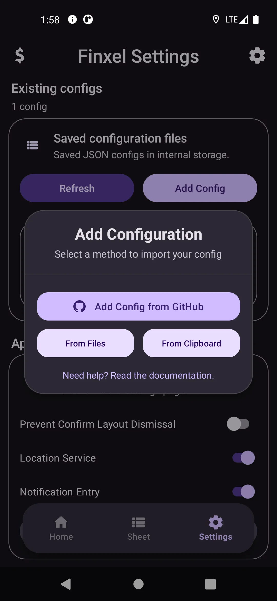
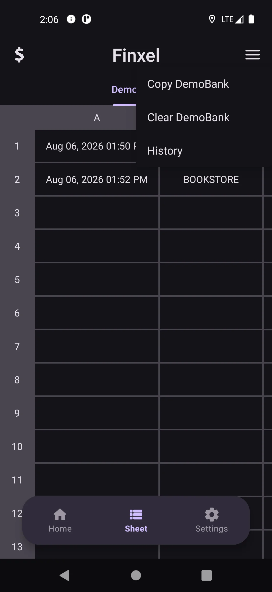
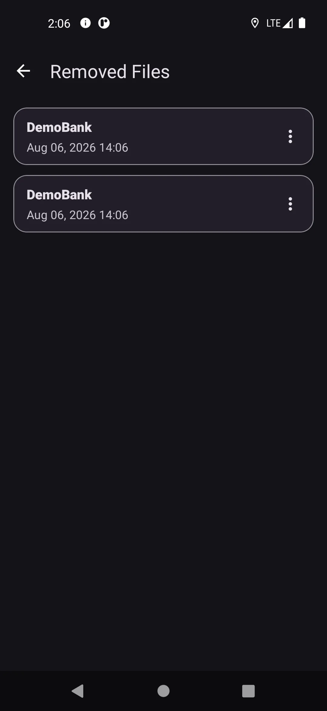
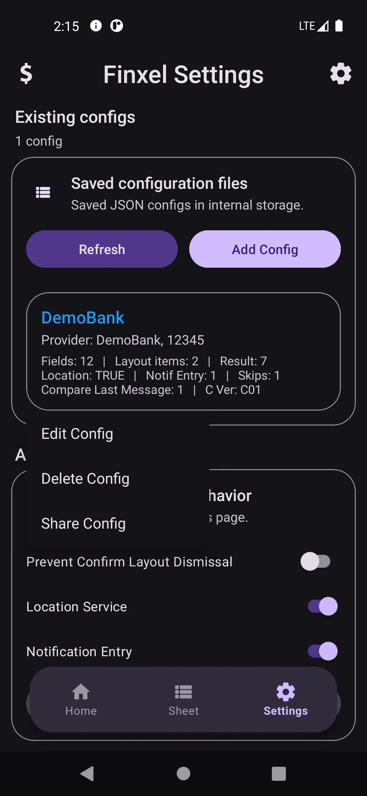

# Getting Started

This guide walks you through downloading, installing, and setting up Finxel for the first time. It assumes you just want to **use** the app, no source code, no Android Studio required.

## 1. Download the app

1. Go to the project's **Releases** page on GitHub.
2. Open the latest release at the top of the list.
3. Under **Assets**, download the `.apk` file (something like `finxel-<version>.apk`).

Finxel is not published on the Google Play Store, so the Releases page is the only official source for installable builds. Avoid downloading the APK from anywhere else.

## 2. Allow installing from this source

Android blocks installing apps from outside the Play Store by default. The first time you try to open the downloaded APK, you'll be prompted to allow it:

1. Tap the downloaded `finxel-<version>.apk` file (from your notification shade or your Files app).
2. If prompted **"For your security, your phone is not allowed to install unknown apps from this source,"** tap **Settings**.
3. Enable **Allow from this source** for the app you used to download the file (Chrome, Files, etc.).
4. Go back and tap the APK file again to continue the install.

You only need to do this once per app you use to download APKs.

## 3. Install and open Finxel

Tap **Install**, wait for it to finish, then tap **Open**.

## 4. Grant the initial permissions

On first launch, Finxel asks for the permissions it needs to read and react to SMS messages (READ_SMS, RECEIVE_SMS, and READ_CONTACTS). A system dialog will appear tap **Allow** (or **While using the app**, depending on your Android version) for each one.

Finxel can't read any messages until these are granted. If you deny them, the app will drop you on the **Settings** tab instead of **Home**, and you can grant permissions later from there or from Android's system settings.

For a full breakdown of every permission Finxel uses (including the optional ones for Location Service and Notification Entry) see **[permissions.md](permissions.md)**.

## 5. Add your first configuration

Finxel doesn't know how to read any specific bank's messages until you give it a **configuration**, a small JSON file describing what to look for and what to extract.

From the **Home** tab (or the **Settings** tab, under *Saved configuration files*), tap **Add Config**:

You'll get a few ways to add one:

- **From Clipboard** copy a config's JSON text somewhere, then tap this to import it directly.
- **From Files** pick a `.json` config file stored on your device.
- **Add Config from GitHub** opens the [community_configs](https://github.com/ahmadrezagh671/Finxel/tree/main/community_configs) folder in the repository, where shared/community configs and examples can be found.
- **Need help? Read the documentation** opens the same help link if you're not sure where to start.

Once a config is imported successfully, it appears as a chip on the Home screen and its name shows up in the **Settings → Saved configuration files** list.

If you want to write your own configuration from scratch (for a bank or provider that isn't covered yet), see **[write-configuration.md](write-configuration.md)** for the complete format.

## 6. Read your messages

Switch to the config you want on the **Home** tab by tapping its chip. Finxel scans your SMS inbox for messages matching that config's provider list, extracts the fields you defined, and shows each message as a card, flagging anything that doesn't parse cleanly.

Tap a message to review/confirm the extracted fields before it's added to the sheet, and tap **Check** to mark it as processed.

## 7. View and export your sheet

Switch to the **Sheet** tab to see your structured results in spreadsheet form.

From the sheet's menu you can:

- **Copy** the sheet's contents to your clipboard (ready to paste into Excel/Google Sheets).
- **Clear** the sheet once you've exported what you need.
- **View History** to see and restore previous exports.

  
  

> **Important: Finxel is only a converter, not a storage app.** Its whole job is to turn your incoming messages into clean, structured rows. Once you've extracted your data, **copy it and paste it into your real finance sheet** Google Sheets, Excel, or wherever you actually keep your records, the same way you'd copy any table out of one app and into another. Don't leave your only copy sitting inside Finxel's sheet or history: treat those as a temporary workspace, not your permanent ledger.

## 8. Turn on optional background features (if you need them)

From the **Settings** tab you can enable:

- **Location Service:** automatically tags matching messages with your device's location at the time they arrived.
- **Notification Entry:** pops up a reply-notification asking for extra info (like "what was this for?") right when a message arrives.

Both are opt-in, require extra permissions, and are explained in detail in **[location-service.md](location-service.md)** and **[notification-entry.md](notification-entry.md)**.

## 9. Edit, Share, or Delete a Configuration

Long-press (or tap, depending on your Android skin) a config chip in **Settings → Saved configuration files** to open its menu:

- **Edit Config** opens the built-in JSON editor so you can tweak the configuration directly on your device.
- **Delete Config** removes it after a confirmation prompt.
- **Share Config** lets you export and share the configuration as a JSON file with other apps or contacts.

## Updating Finxel

Finxel doesn't currently auto-update. To get a new version, download the latest APK from the Releases page and install it over the existing app, your configs, sheets, and history are kept as long as you don't uninstall first.

**Before you update, back up your data as a safety precaution.** Installing a new version over an old one is usually safe, but it isn't guaranteed, a failed install, a skipped version, or a change between releases could leave your local data corrupted or unreadable. To be safe:

- Copy anything important out of your **Sheet** tab into your real finance records first (see [Should I keep my financial records inside Finxel?](faq.md#should-i-keep-my-financial-records-inside-finxel)), don't let an update be the reason you lose data you never exported.
- Save a copy of each of your config files somewhere outside the app (a notes app, cloud drive, or your computer), so you can re-import them if anything goes wrong.

If an update ever does cause problems, you can always uninstall, reinstall the latest APK fresh, and re-import your saved configs, as long as you kept copies.

## Next steps

- [Permissions](permissions.md) understand exactly what Finxel can access and why.
- [Writing a Configuration](write-configuration.md) build your own provider config.
- [FAQ](faq.md) answers to common questions.
- [Building from Source](building-from-source.md) want to compile Finxel yourself instead of using the APK? Start here.
- Join the community: [Telegram Channel](https://t.me/FinxelApp) for announcements, or [Telegram Group](https://t.me/FinxelCommunity) for chat and questions.
